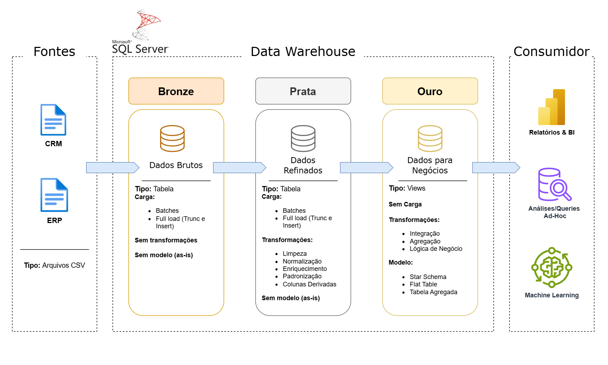

# 📦 Data Warehouse com SQL Server

Este projeto implementa um Data Warehouse utilizando SQL Server, seguindo uma arquitetura moderna em camadas que organiza os dados desde a ingestão bruta até a disponibilização para consumo analítico.

---

## ✔️ Requisitos do Projeto

### Objetivo

Desenvolver um data warehouse moderno utilizando SQL Server para consolidar dados de vendas, possibilitando a elaboração de relatórios analíticos para tomada de decisão.

### Especificações

- Consolidar dados de múltiplas fontes (CRM, ERP, CSV) em uma única plataforma analítica.

- Garantir que os dados passem por etapas claras de tratamento e refino.

- Combinar ambas fontes em um único modelo de dados acessível para consultas analíticas.

- Providenciar documentação clara do modelo de dados para times de analitycs e stakeholders.

## :hammer: Implementação

### 📐 Arquitetura da Solução



A solução é composta por:

- **Fontes**: CRM, ERP e arquivos CSV
- **Data Warehouse**: SQL Server

  - **Camadas**: Bronze, Prata e Ouro

- **Consumidores**: Power BI, consultas SQL e Machine Learning

Na pasta 'docs' estão contidas mais ilustrações da arquitetura do projeto e o fluxo de dados.

### 🚀 Tecnologias Utilizadas

- SQL Server
- T-SQL
- Draw.io
- Notion

### 📂 Estrutura do Repositório

```
LICENSE
README.md
├── datasets/
│   ├── source_crm/
│   │   ├── cust_info.csv
│   │   ├── prd_info.csv
│   │   └── sales_details.csv
│   └── source_erp/
│       ├── CUST_AZ12.csv
│       ├── LOC_A101.csv
│       └── PX_CAT_G1V2.csv
├── docs/
│   ├── diagrama_data_flow.png
│   ├── diagrama_de_arquitetura.png
│   ├── diagrama_de_integracao.png
│   └── diagrama_modelo_logico.png
├── src/
│   ├── init_database.sql
│   ├── bronze/
│   │   ├── ddl_bronze.sql
│   │   └── load_bronze.sql
│   ├── ouro/
│   │   └── ddl_ouro.sql
│   └── prata/
│       ├── ddl_prata.sql
│       └── load_prata.sql
└── tests/
    ├── teste_qualidade_ouro.sql
    └── teste_qualidade_prata.sql
```

## 📋 Próximos Passos

### Construção de Relatório Power BI

O próximo passo envolve a criação de um relatório interativo no Power BI que utilize o modelo de dados consolidado na camada Ouro do Data Warehouse. Este relatório permitirá:

- Visualização de métricas de vendas em tempo real
- Análise de performance por região e período
- Segmentação de clientes e produtos
- Dashboards executivos para tomada de decisão estratégica

A integração com SQL Server será realizada através de conexões diretas às tabelas da camada Ouro, garantindo que os dados apresentados estejam sempre atualizados e alinhados com a fonte única de verdade.

## 🧾 Licença

Projeto disponibilizado sob licença MIT.
